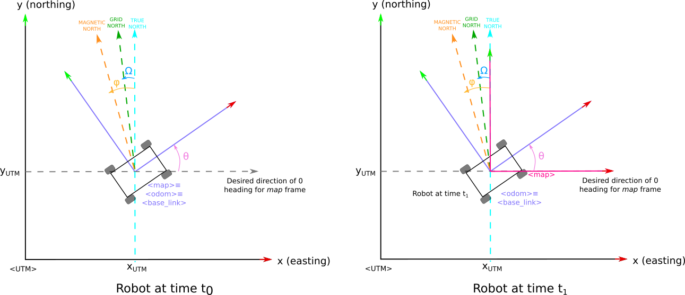

robot_localization
==================

robot_localization is a package of nonlinear state estimation nodes. The package was developed by Charles River Analytics, Inc.

Please see documentation here: http://wiki.ros.org/robot_localization

## Requirements

- ROS2 Humble

## About the following documentation

> **This is *supplementary* documentation only.** It does not replace the official docs — for the general explanation of the package and of `navsat_transform_node`, always refer first to:
> https://docs.ros.org/en/noetic/api/robot_localization/html/
>
> The purpose of these notes is only to:
> - (a) collect the full, up-to-date list of ROS 2 parameters for `navsat_transform_node`
> - (b) clarify exactly how the `map` frame is computed from GPS + IMU data, since a few details here differ slightly from what the official docs show and match the actual ROS 2 Humble source code more closely.

## `navsat_transform_node` parameters (ROS 2)

Complete list of parameters exposed by `navsat_transform_node`:

- `frequency`: The real-valued frequency, in Hz, at which `navsat_transform_node` checks for new `sensor_msgs/NavSatFix` messages, and publishes filtered `sensor_msgs/NavSatFix` when `publish_filtered_gps` is set to true.
- `delay`: The time, in seconds, to wait before calculating the transform from GPS coordinates to your robot’s world frame.
- `magnetic_declination_radians`: Enter the magnetic declination for your location. If you don’t know it, see [NOAA: Magnetic Field Calculators](http://www.ngdc.noaa.gov/geomag-web) (make sure to convert the value to radians). This parameter is needed if your IMU provides its orientation with respect to the magnetic north.
- `yaw_offset`: You IMU should read `0` for yaw when facing east. If it doesn’t, enter the offset here (`desired_value = offset + sensor_raw_value`). For example, if your IMU reports `0` when facing north, as most of them do, this parameter would be `pi/2` (`~1.5707963`). This parameter changed in version 2.2.1. Previously, `navsat_transform_node` assumed that IMUs read `0` when facing north, so `yaw_offset` was used acordingly.
- `zero_altitude`: If this is `true`, the `nav_msgs/Odometry` message produced by this node has its pose Z value set to `0`.
- `broadcast_cartesian_transform`: If this is `true`, `navsat_transform_node` will broadcast the transform between the UTM grid and the robot's world frame (e.g. `map`) frame.
- `broadcast_cartesian_transform_as_parent_frame`: If `true`, `navsat_transform_node` will publish the `utm->world_frame` transform instead of the `world_frame->utm` transform. Note that for the transform to be published `broadcast_cartesian_transform` also has to be set to `true`.
- `publish_filtered_gps`: If `true`, `navsat_transform_node` will also transform your robot’s world frame (e.g., `map`) position back to GPS coordinates, and publish a `sensor_msgs/NavSatFix` message on the `/gps/filtered` topic.
- `use_odometry_yaw`:If `true`, `navsat_transform_node` will not get its heading from the IMU data, but from the input odometry message. Users should take care to only set this to true if your odometry message has orientation data specified in an earth-referenced frame, e.g., as produced by a magnetometer. Additionally, if the odometry source is one of the state estimation nodes in `robot_localization`, the user should have at least one source of absolute orientation data being fed into the node, with the differential and relative parameters set to false.
- `wait_for_datum`: If `true`, `navsat_transform_node` will wait to get a datum from either:
  - The datum parameter
  - The set_datum service
- `datum`: Specifies a fixed reference datum (`[latitude, longitude, yaw]`) that overrides the GPS-provided position. This parameter is only used when `wait_for_datum` is set to `true`.
- `transform_timeout`: This parameter specifies how long we would like to wait if a transformation is not available yet. Defaults to `0` if not set. The value `0` means we just get us the latest available (see `tf2` implementation) transform.
- `gps_topic`: Name of the input topic containing a `sensor_msgs/NavSatFix` message containing your robot’s GPS coordinates
- `odom_topic`: Name of the input topic containing a `nav_msgs/Odometry` message of your robot’s current position. This is needed in the event that your first GPS reading comes after your robot has attained some non-zero pose.
- `gps_odom_topic`: Name of the output topic containing a `nav_msgs/Odometry` message containing the GPS coordinates of your robot, transformed into its world coordinate frame. This message can be directly fused into `robot_localization`‘s state estimation nodes.
- `gps_filtered_topic`: (optional) Name of the output topic containing a `sensor_msgs/NavSatFix` message containing your robot’s world frame position, transformed into GPS coordinates
- `imu_topic`: Name of the input topic containing a `sensor_msgs/Imu` message with orientation data

## How the `map` frame is computed (AHRS IMU case)

The diagram below extends the one from the official [Integrating GPS → Details](https://docs.ros.org/en/noetic/api/robot_localization/html/integrating_gps.html#details) page, adding the correction angles that `navsat_transform_node` actually uses in code.



**This section assumes an AHRS IMU that provides heading relative to magnetic north**. Under that assumption, the aim is to find the robot world frame (e.g. `map`), expressed as an ENU frame (x -> east, y -> north and z -> up) with respect to the UTM grid frame, following the REP-105 convention. That means solving for:

- **X_UTM, Y_UTM**: the 2D position of the `map` frame origin in the UTM frame. These come directly from converting the GPS lat/lon fix to UTM cartesian coordinates.
- **Θ**: the orientation (yaw) of the `map` frame in the UTM frame, obtained by correcting the IMU's raw heading with three angles:

| Symbol | Name | Meaning |
|---|---|---|
| φ | Magnetic declination | Angle between true north and magnetic north at your location. Known a priori (lookup table / NOAA calculator); set via `magnetic_declination_radians` parameter. It exists because Earth's magnetic field doesn't point at the geographic pole. |
| Ω | UTM grid convergence | Angle between UTM grid north and true north. Depends on the UTM zone and is computed automatically by `navsat_transform_node` via [GeographicLib](https://geographiclib.sourceforge.io/). It exists because UTM projects a curved Earth onto a flat grid. |
| θ_offset | Yaw offset | Correction if the IMU doesn't follow the REP-105 convention (0 = east); set via `yaw_offset` parameter. |

The robot's yaw in the UTM frame is then:

```

θ = φ + Ω + θ_offset + θ_curr
```

where `θ_curr` is the raw yaw currently reported by the IMU.

As the diagram shows, at time `t0`, the moment the first GPS/IMU fix arrives, `map ≡ odom ≡ base_link`. Once the correction above is applied, `map` becomes a fixed ENU frame that will generally *differ* from `odom` and `base_link` at all later times (they'd only coincide if the robot happened to be perfectly aligned with true east at `t0`, which is rare).

## Using navsat_transform without an absolute-heading IMU

Everything above assumes an AHRS IMU with an absolute heading (magnetic or otherwise), which is what lets you build a proper ENU `map` frame. **You don't strictly need such an IMU to use outdoor localization** — but without it you won't get an absolute-pose ENU frame. Concretely:

- **With absolute IMU heading, used by the global EKF:** at `t0`, `map` is ENU-aligned, and generally `odom == base_link != map`.
- **Without absolute IMU heading (or not fusing it into the global EKF):** at `t0`, `map == odom == base_link`.

**Important:** if you don't have a magnetometer-equipped IMU but still need an ENU-referenced `map` frame, you must remove yaw from the IMU input to the global EKF. You can get an approximate ENU alignment by physically orienting the robot's x-axis to face east *before* starting the outdoor localization pipeline — this won't be fully precise, but it's a usable workaround.

To fuse (or not fuse) IMU yaw in the global EKF, set the `imu0_config` matrix accordingly:

**Fuse yaw:**
```yaml
ekf_filter_node_map:
...
    imu0_config: [False, False, False,
                False, False, True,
                False, False, False,
                False, False, False,
                False, False, False]
```

**Don't fuse yaw:**
```yaml
ekf_filter_node_map:
...
    imu0_config: [False, False, False,
                False, False, False,
                False, False, False,
                False, False, False,
                False, False, False]
```